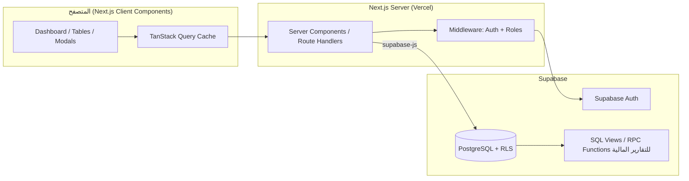

# العمارة التقنية (Architecture) — نظام إدارة السائقين والرحلات والربحية

> المرحلة 1 من 23. هذا المستند يُعتمد قبل كتابة أي كود واجهات.

## 1. نظرة عامة

النظام تطبيق ويب لإدارة تشغيل أسطول سائقين: تسجيل رحلات، حساب تربة كل سائق،
تتبع مصروف الديزل، إدارة الرواتب/السلف/الخصومات، وحساب ربحية كل رحلة/سائق/شركة،
مع فصل صارم بين البيانات الإدارية السرية (سعر الرحلة، الربح) وبين ما يظهر للسائق.

## 2. اختيار التقنيات (Stack) والسبب

| الطبقة | الاختيار | لماذا |
|---|---|---|
| Framework | **Next.js 15 (App Router) + TypeScript** | يدعم Vercel مباشرة، يسمح بصفحة هبوط SSR سريعة + تطبيق Dashboard في نفس المشروع، ويجهزنا لاحقاً لتحويل النظام إلى SaaS (multi-tenant routing, middleware auth) |
| UI | **Tailwind CSS + shadcn/ui (Radix)** | مكونات جاهزة (Modal, Dropdown, Table, Toast...) قابلة للتخصيص بالكامل، خفيفة، وتدعم RTL بسهولة عبر logical properties |
| الخط | Google Font **Cairo** أو **Tajawal** | خط عربي حديث ومقروء في الجداول المالية |
| إدارة البيانات | **TanStack Query (React Query)** | Cache، إعادة تحقق تلقائية، Optimistic Updates، تقليل الطلبات المكررة |
| النماذج | **react-hook-form + zod** | Validation قوي من جهة العميل قبل الإرسال لـ Supabase |
| الرسوم البيانية | **Recharts** | بسيطة وخفيفة وتدعم RTL |
| قاعدة البيانات | **Supabase (PostgreSQL)** | Auth + RLS + Realtime جاهزة، بدون تشغيل سيرفر خاص |
| المصادقة | **Supabase Auth** (Email/Password بداية) | جاهزة للتوسعة لاحقاً (روابط دعوة، أدوار متعددة) |
| PDF | طباعة عبر CSS مخصص للطباعة (`@media print`) + **jsPDF/html2canvas** كخيار تصدير مباشر | لا حاجة لسيرفر PDF منفصل، ويعمل فوراً على Vercel بدون تكلفة إضافية |
| CSV/Excel | تصدير من جهة العميل (SheetJS/`xlsx`) | لا حاجة لباك-إند إضافي |
| الاستضافة | **Vercel** | Next.js أصلي، Preview URLs لكل تعديل |

**لا نستخدم**: Excel/Sheets كقاعدة بيانات، ولا LocalStorage كمصدر حقيقة أساسي (يُستخدم فقط لتفضيلات واجهة بسيطة كحالة القائمة الجانبية).

## 3. المعمارية العامة



**مبدأ أساسي**: كل حساب مالي (ربح الرحلة، إجمالي التربات، صافي الراتب...) يُحسب داخل
قاعدة البيانات (Generated Columns أو Views أو RPC Functions)، وليس في JavaScript على
الواجهة. هذا يمنع اختلاف الأرقام بين الشاشات، ويحل مشكلة دقة الفاصلة العشرية.

## 4. هيكل المجلدات (سيُنشأ في Phase 3 عند تهيئة المشروع)

```
logistic/
├── docs/                          ← مستندات المرحلة 1 (هذا الملف وما يرافقه)
├── supabase/
│   └── migrations/                ← ملفات SQL مرقّمة (schema, RLS, views, functions)
├── src/
│   ├── app/
│   │   ├── (marketing)/           ← صفحة الهبوط العامة
│   │   ├── (auth)/login/
│   │   ├── (dashboard)/
│   │   │   ├── dashboard/
│   │   │   ├── drivers/
│   │   │   ├── companies/
│   │   │   ├── trips/
│   │   │   ├── salaries/
│   │   │   ├── reports/
│   │   │   │   ├── drivers/  companies/  trips-profitability/
│   │   │   │   ├── advances-deductions/  diesel/  financial/
│   │   │   └── settings/
│   ├── components/
│   │   ├── ui/                    ← مكونات shadcn العامة
│   │   ├── statements/
│   │   │   ├── InternalStatement.tsx   ← الكشف الداخلي (سري)
│   │   │   └── DriverStatement.tsx     ← كشف السائق (بدون أي بيانات سرية)
│   ├── lib/
│   │   ├── supabase/ (client.ts, server.ts, middleware.ts)
│   │   ├── calculations.ts        ← دوال عرض فقط (formatting)، ليست مصدر الحساب
│   │   └── queries/                ← دوال React Query لكل كيان
│   └── types/database.ts          ← أنواع تُولَّد تلقائياً من Supabase (supabase gen types)
```

## 5. فصل السرية على مستوى الكود (وليس فقط التصميم)

هذا يعالج المتطلب #40/#50/#51 بشكل معماري صارم:

- `InternalStatement.tsx` و `DriverStatement.tsx` **مكوّنان منفصلان تماماً**، لا يتشاركان
  props تحمل `trip_amount` أو `trip_profit`.
- الاستعلام الذي يغذي `DriverStatement` هو دالة SQL/Query منفصلة (`fn_driver_public_statement`)
  لا تُرجع أعمدة `trip_amount` أو `trip_profit` من الأساس — بحيث حتى لو حدث خطأ برمجي
  في الواجهة، البيانات السرية **لم تصل أصلاً** إلى المتصفح.
- هذا أفضل من "إخفاء عمود في الواجهة فقط"، لأن الإخفاء في الواجهة فقط يمكن أن يُكتشف
  عبر أدوات المطوّر (DevTools/Network tab).

## 6. الأدوار والصلاحيات (RLS) — المرحلة الحالية والتوسع المستقبلي

- **المرحلة الأولى**: دور واحد فعّال هو `admin` فقط. كل مستخدم مسجّل يُنشأ له تلقائياً
  صف في جدول `profiles` بحقل `role`.
- **جاهز للتوسع**: `role` من نوع ENUM يحتوي مسبقاً على
  (`admin`, `accountant`, `employee`, `driver`) — بحيث عند تفعيل دور "سائق" مستقبلاً
  (ليدخل ويرى كشف حسابه فقط)، لا حاجة لتغيير بنية الجدول، فقط إضافة سياسات RLS جديدة.
- سياسات RLS تُفعَّل على **كل الجداول** من اليوم الأول (لا نؤجلها لـ Phase 20) حتى لا
  نبني شاشات على افتراض غير آمن.

## 7. التعامل مع الرحلات الملغاة (بند 48)

جدول `settings` يحوي عمود `count_cancelled_trips_in_profit boolean default false`.
كل دوال التقارير تتحقق من هذا الإعداد قبل تضمين رحلة `status = 'cancelled'`.

## 8. المضاعفة المستقبلية إلى SaaS

لا نبني Multi-tenancy فعلياً الآن (هذا سيكون تعقيداً غير مبرر في هذه المرحلة)، لكن:
- كل الجداول تستخدم `id uuid` (وليس `serial`) — متوافق مع أي تقسيم مستقبلي بـ `organization_id`.
- طبقة `lib/queries` معزولة عن مكونات الواجهة، فإضافة فلترة `organization_id` لاحقاً
  تكون في مكان واحد فقط.
- هذا مذكور كـ "مسار توسّع" موثّق، وليس كوداً معطلاً غير مستخدم الآن.

## 9. الأداء

- Pagination من جهة الخادم (`range()` في Supabase) لكل الجداول الكبيرة (رحلات، تقارير).
- Indexes على كل الأعمدة المستخدمة في الفلترة (موثقة في `02-database-schema.sql`).
- React Query: `staleTime` للبيانات شبه الثابتة (شركات، سائقين) لتقليل الطلبات.
- التقارير الثقيلة (تجميعات) تُنفَّذ كـ SQL Functions/Views داخل Postgres، لا JS تجميع يدوي.
