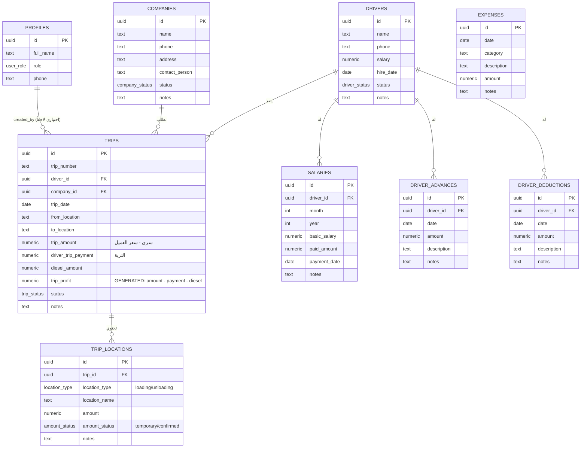

# مخطط العلاقات (ERD)

## ملاحظات على العلاقات

- `TRIPS → TRIP_LOCATIONS`: **1 إلى عدد غير محدود**، `ON DELETE CASCADE` (حذف الرحلة يحذف مواقعها).
- `DRIVERS → TRIPS`: `ON DELETE RESTRICT` — **لا يمكن حذف سائق له رحلات** (لحماية السجل
  المالي التاريخي). البديل هو تغيير حالته إلى "غير نشط".
- `COMPANIES → TRIPS`: نفس منطق `RESTRICT` لنفس السبب.
- `DRIVERS → SALARIES / ADVANCES / DEDUCTIONS`: `ON DELETE CASCADE` (هذه سجلات تابعة
  بالكامل للسائق، لا معنى لبقائها بدونه) — لكن عملياً سنمنع حذف السائق أصلاً إن كانت
  له بيانات مالية (نفس منطق الرحلات)، والـ CASCADE هنا هو شبكة أمان إضافية فقط.
- `EXPENSES`: جدول مستقل (مصروفات إدارية عامة)، غير مرتبط بسائق أو رحلة.
